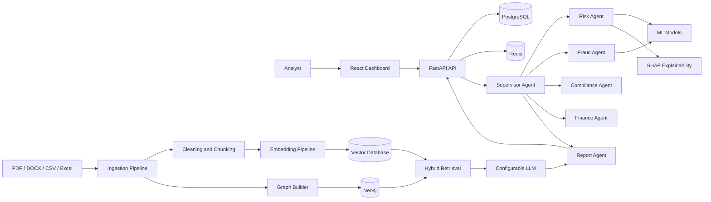
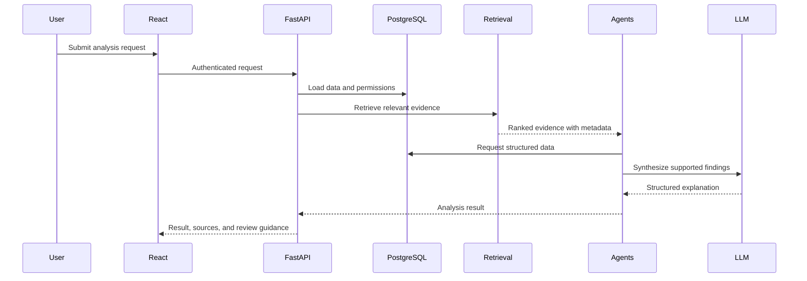

# System Architecture

## Purpose

AI Financial Risk Intelligence is a modular financial decision-support platform combining:

- Structured financial data
- Machine learning
- Explainable AI
- Financial document processing
- RAG and hybrid retrieval
- Graph RAG
- Multi-agent analysis
- FastAPI
- React
- PostgreSQL, Redis, and Neo4j

The platform must not make autonomous lending, fraud, or compliance decisions.

## High-Level Architecture



## Component Responsibilities

### React Frontend

Located in `frontend/`.

Responsibilities:

- Authentication interface
- Risk dashboard
- Customer risk analysis
- Fraud analysis
- Document upload
- RAG chat
- Compliance analysis
- Report visualization

The frontend must not contain ML, database, or RAG business logic.

### FastAPI API

Located in `src/api/`.

Responsibilities:

- Request validation
- Authentication and authorization
- API routing
- Response serialization
- Health and readiness endpoints

Routes should call services and must not contain large business workflows.

### Service Layer

Located in `src/services/`.

Responsibilities:

- Coordinate application workflows
- Call repositories and AI components
- Manage business logic
- Create audit records
- Return structured results

### PostgreSQL

PostgreSQL is the source of truth for structured operational data:

- Users
- Customers
- Accounts
- Loans
- Transactions
- Documents
- Predictions
- Reports
- Chat history
- Audit logs

### Redis

Redis is used for:

- Caching
- Rate limiting
- Temporary state
- Celery task coordination

Redis must not be the only permanent store for business records.

### Machine Learning

Located in `src/ml_models/`.

ML models are responsible for numerical predictions:

- Credit default probability
- Fraud probability
- Risk bands
- Feature-based classification

Training and inference must remain separate. Models must not be trained inside API request handlers.

### Explainable AI

Located in `src/ml_models/explainability/`.

SHAP or equivalent methods should provide:

- Prediction probability
- Model version
- Positive risk factors
- Negative risk factors
- Feature impact values

Model outputs must be presented as risk estimates requiring human review.

### Document Ingestion

Located in `src/ingestion/`.

The ingestion pipeline performs:

1. File validation
2. Text or table extraction
3. OCR when required
4. Text cleaning
5. Chunking
6. Metadata creation
7. Embedding and indexing

Raw datasets in `data/raw/` must remain unchanged.

### Vector Database

Located behind `src/vectordb/`.

The vector database stores:

- Document chunks
- Embeddings
- Page numbers
- Source information
- Document metadata

The vector database is used for semantic retrieval and is not the source of truth for transactional data.

### Retrieval Layer

Located in `src/retriever/`.

The retrieval layer may include:

- Query rewriting
- BM25 search
- Vector search
- Hybrid search
- Reranking
- Parent-child retrieval
- Self-RAG validation

Initial retrieval should support a configurable combination of BM25 and vector similarity.

### Neo4j and Graph RAG

Located in `src/graph_rag/`.

Neo4j stores relationship-based information such as:

- Customer to account
- Customer to loan
- Customer to transaction
- Transaction to merchant
- Customer to device
- Customer to address
- Document to regulation

Graph retrieval is used for relationship investigation, such as identifying customers connected to suspicious devices or transactions.

### LLM Layer

Located in `src/llm/`.

Responsibilities:

- Natural-language understanding
- Summarization
- Evidence-based explanation
- Report generation
- Agent coordination

The LLM must not replace deterministic calculations, ML predictions, or database queries. It must not fabricate financial facts or citations.

## Multi-Agent Architecture

Located in `src/agents/`.

### Supervisor Agent

Routes requests only to the required specialist agents.

### Risk Agent

- Retrieves customer and loan data
- Calls the credit-risk model
- Obtains SHAP explanations
- Returns structured credit-risk results

### Fraud Agent

- Retrieves transaction data
- Calls the fraud model
- Investigates suspicious relationships
- Returns structured fraud-risk results

### Compliance Agent

- Searches trusted regulatory documents
- Retrieves and reranks evidence
- Returns citation-backed compliance findings

### Finance Agent

- Calculates financial ratios
- Compares reporting periods
- Analyzes statements and trends

### Report Agent

Combines specialist outputs while clearly distinguishing:

1. ML predictions
2. Retrieved evidence
3. LLM-generated explanations
4. Recommended human-review actions

## Data Pipelines

### Structured Data Pipeline

```text
CSV / Excel / API
        |
        v
Ingestion
        |
        v
Cleaning and Validation
        |
        v
Feature Engineering
        |
        +------------------+
        |                  |
        v                  v
   Analytics          ML Inference
                           |
                           v
                      Risk Results
```

### Document Pipeline

```text
PDF / DOCX / Report
        |
        v
Parser and OCR
        |
        v
Cleaning
        |
        v
Chunking and Metadata
        |
        +------------------+
        |                  |
        v                  v
   Vector Database      Neo4j
        |                  |
        +--------+---------+
                 v
         Hybrid Retrieval
                 |
                 v
             Reranking
                 |
                 v
                LLM
```

## Trust and Security Boundaries

1. Uploaded files are untrusted input.
2. File types and file sizes must be validated.
3. Secrets must come from environment variables or a secret manager.
4. Customer PII must not be exposed in logs.
5. Authorization must occur before database or document retrieval.
6. Retrieved document content must be separated from system instructions.
7. API errors must not expose stack traces or credentials.
8. Raw datasets must not be modified or committed if they contain sensitive data.
9. RAG citations must refer only to actually retrieved sources.
10. Insufficient evidence must be reported explicitly.

## Request Lifecycle



## Implementation Order

1. Configuration and logging
2. PostgreSQL and database models
3. Data ingestion
4. EDA
5. Credit-risk and fraud models
6. Document processing
7. Embeddings
8. Vector database
9. Basic RAG
10. Hybrid retrieval and reranking
11. Neo4j and Graph RAG
12. Multi-agent workflows
13. FastAPI routes and services
14. React dashboard
15. Evaluation
16. Docker and CI/CD

## MVP Scope

The first working version should include only:

```text
CSV ingestion
    -> EDA
    -> Credit-risk model
    -> Fraud model
    -> PDF ingestion
    -> Basic RAG
    -> FastAPI
    -> Simple dashboard
```

Graph RAG and multi-agent workflows should be added only after the MVP is functional.

## Financial Safety Principle

Use:

- “Predicted risk probability”
- “High fraud-risk score”
- “Recommended for human review”
- “Insufficient evidence from available sources”

Avoid:

- “Guaranteed fraud”
- “Automatically reject”
- “Definitely compliant”
- “Automatically approve”

This platform provides explainable decision support, not final financial or legal authority.