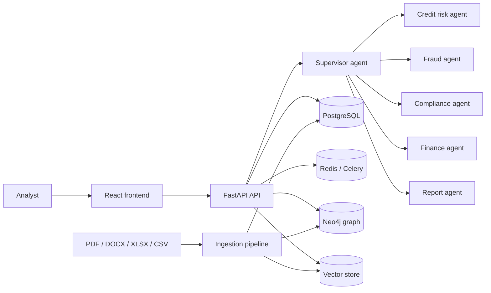
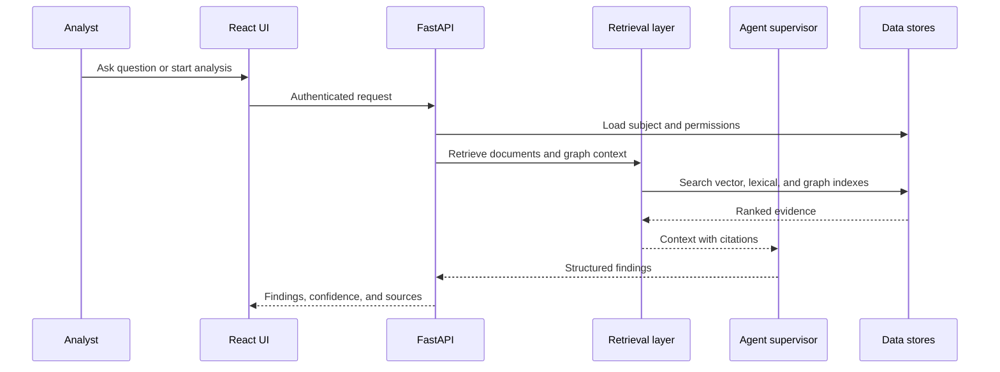

# System Architecture

## Purpose

AI Financial Risk Intelligence is an analysis platform for financial institutions. It combines structured data, financial documents, machine-learning models, retrieval-augmented generation, and specialist agents into explainable risk workflows.

## High-Level Flow

## Components

### Frontend

The React/Vite frontend is located in `frontend/`. It provides the analyst workspace, dashboard metrics, priority cases, customer views, and document views. The service boundary in `frontend/src/services/riskApi.js` supports a live API and a local mock fallback while backend endpoints are being implemented.

### API Layer

The FastAPI application belongs in `src/api/`. It owns authentication, request validation, routing, dependency checks, and response serialization. Long-running operations should return a job identifier rather than keeping an HTTP request open.

### Ingestion

The ingestion layer accepts documents and external data sources, then applies parsing, OCR, cleaning, metadata extraction, and parent-child chunking. Each chunk should retain document identity, page or row location, source URI, customer association, and ingestion timestamp.

### Retrieval

Hybrid retrieval combines lexical BM25 search with vector similarity. Graph retrieval uses Neo4j relationships such as customer, account, transaction, document, sector, and regulation. Results are merged, re-ranked, and compressed before being passed to an agent.

### Multi-Agent Analysis

The supervisor routes work to specialist agents:

- Credit risk: probability of default, exposure, affordability, and loan recommendations
- Fraud: transaction anomalies, duplicates, suspicious activity, and AML signals
- Compliance: KYC, AML, RBI, SEBI, and Basel-related checks
- Finance: revenue, profitability, ratios, and cash-flow analysis
- Report: explainable summaries with findings, confidence, and citations

Agents should return structured findings rather than only prose. Every material conclusion should identify its evidence and uncertainty.

### Storage

- PostgreSQL stores users, customers, cases, analyses, reports, and audit records.
- Redis supports caching, rate limiting, and Celery task coordination.
- Neo4j stores relationships used for graph traversal and contextual retrieval.
- A vector database stores embedding records for semantic search. Pinecone, Milvus, ChromaDB, or FAISS can be selected by deployment configuration.
- The `data/`, `models/`, and `logs/` directories provide local development storage and should not be treated as production durability guarantees.

## Data and Trust Boundaries

1. Uploaded files are untrusted input and must be type-checked, size-limited, malware-scanned, and stored outside the application source tree in production.
2. Parsed content must be isolated from system instructions before it is sent to an LLM.
3. Secrets such as database passwords, API keys, and signing keys must be injected through a secret manager or environment variables, never committed to the repository.
4. Tenant and customer authorization must be applied before retrieval, not only after an answer is generated.
5. Generated output is decision support. A human reviewer remains responsible for regulated decisions.

## Request Lifecycle

## Operational Principles

- Prefer asynchronous jobs for ingestion, embedding, model inference, and report generation.
- Record model name, prompt version, retrieval parameters, and source identifiers for reproducibility.
- Make writes idempotent using stable document, job, and analysis identifiers.
- Expose health and readiness checks separately.
- Emit structured logs with request and job identifiers while excluding raw sensitive document content.
- Keep model thresholds and external provider settings in configuration, not in route handlers.

## Current Repository Status

The repository contains the package layout, frontend scaffold, container orchestration, model artifact locations, and service placeholders. The API modules and `src/main.py` still need implementation before the backend can serve requests. This document describes the target architecture and integration boundaries for that implementation.
